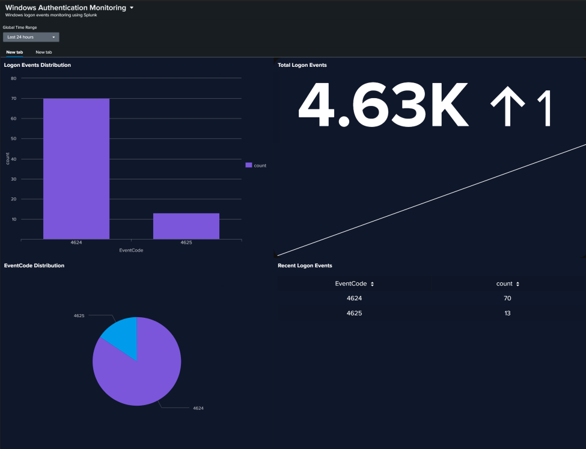
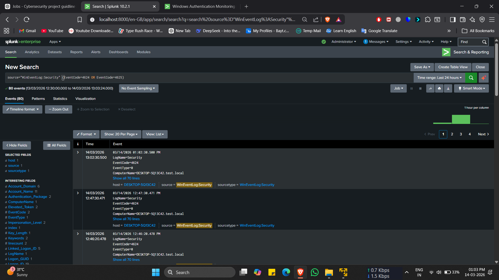
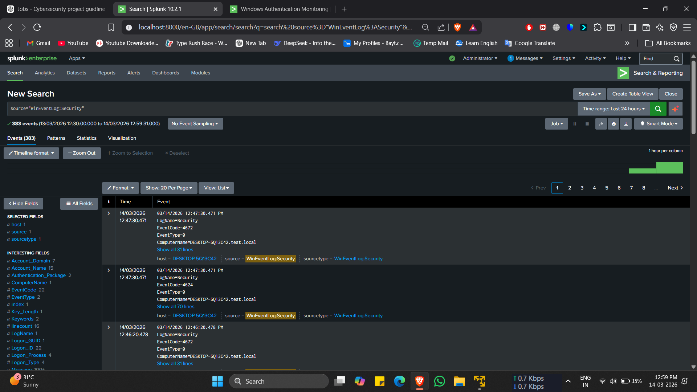
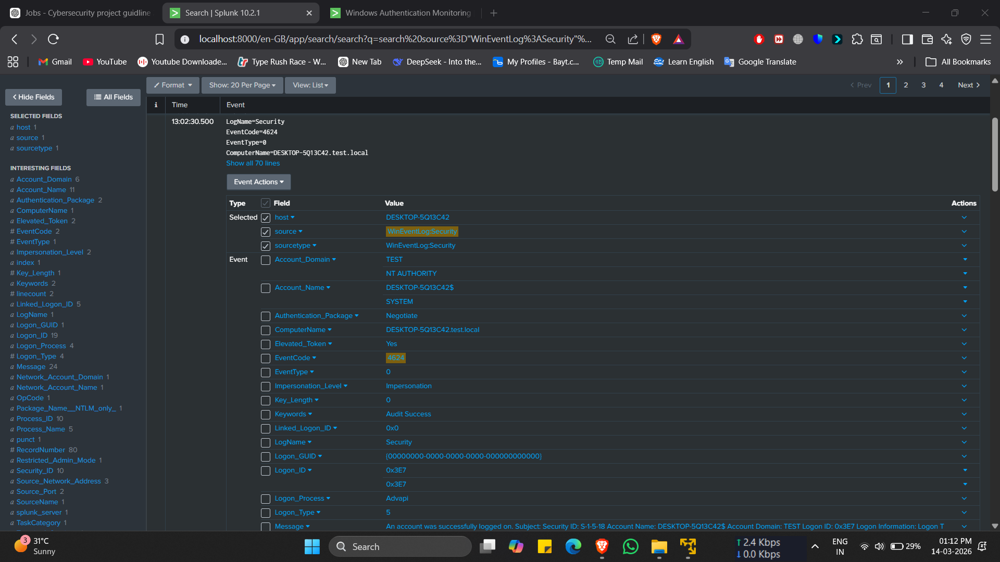

# Windows Authentication Monitoring using Splunk

## Overview
This project monitors Windows authentication activity using Splunk SIEM. It analyzes Windows Security Event Logs to detect successful and failed logon attempts.

## Log Source
Windows Security Event Log

Important Events:
- 4624 → Successful Logon
- 4625 → Failed Logon

## Dashboard Components
- Total Logon Events (Single Value)
- Logon Events Distribution (Column Chart)
- EventCode Distribution (Pie Chart)
- Recent Logon Events (Table)

## Detection Logic
Authentication events were filtered using:

```spl
source="WinEventLog:Security" (EventCode=4624 OR EventCode=4625)
```
## Architecture

Windows System → Security Event Logs → Splunk Universal Forwarder → Splunk Enterprise → Dashboard Visualization


## Skills Demonstrated

- Security Event Log Analysis
- Splunk Search Processing Language (SPL)
- SIEM Dashboard Creation
- Authentication Monitoring
- Log Investigation


## Use Case

Security analysts can use this dashboard to monitor authentication activity on Windows systems and quickly identify abnormal login behavior such as repeated failed login attempts.


## Screenshots

### Splunk Authentication Monitoring Dashboard


### Windows Security Log Ingestion in Splunk


### Authentication Event Query Results


### Raw Windows Security Event Details


